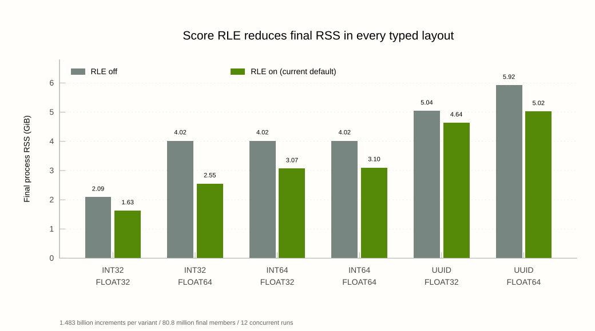
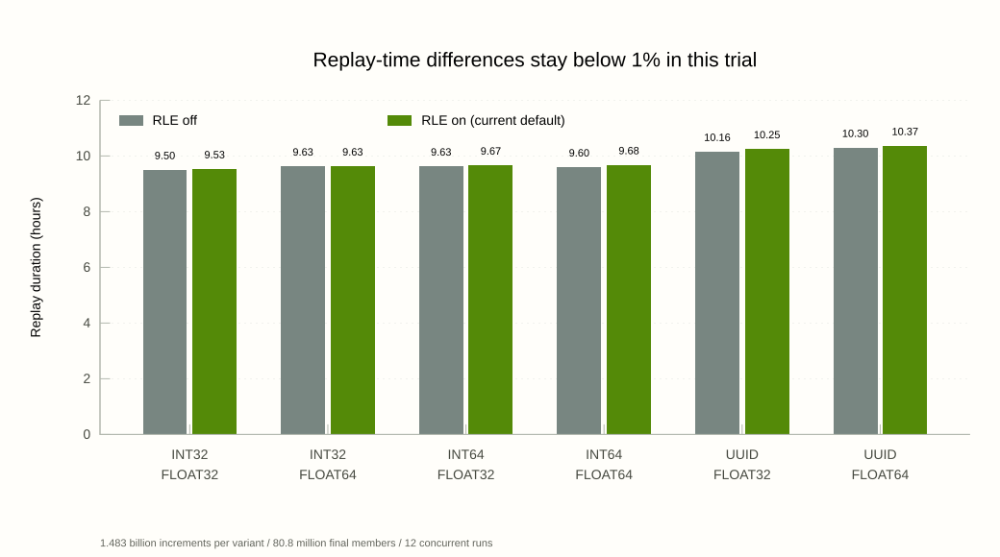

# Wikimedia replay: 80.8 million page counts in 1.63 GiB

September 22, 2026. Score run-length encoding (RLE) reduced the final RSS of
the Wikimedia INT32/FLOAT32 packed zset from **2.089 to 1.626 GiB**, saving
**22.19%** while replay time increased by **0.32%**. That set contains
**80,798,328 page IDs** after **1,483,700,913 edit-count increments**.

All **12 typed-layout/RLE combinations passed** the full replay on `naamah`.
Across all six layouts, RLE saved **8.08–36.52%** of final process RSS, with
measured replay-time increases of **0.03–0.92%**. Score RLE is now **on by
default for typed packed zsets**, with a command-line opt-out. These timings
come from one concurrent trial per variant; differences below 1% are not
established performance regressions without repeated trials.

The complete job, including verification and input checksum checks, finished
at **10:42:37 a.m. EDT** (14:42:37 UTC). All benchmark servers exited after
verification. The controller recorded `JOB-PASS` and exit status zero.

## Memory as entries are added

The new packed RLE result improves on both earlier Goblin representations and
the incumbents in the verified full replays. At the same final state, it uses
**22.64% less RSS than our earlier packed result**, **53.00% less than standard
Goblin**, and **64.12–78.47% less than Dragonfly, Valkey, and Redis**.


The horizontal axis is **live unique page IDs**, measured with `ZCARD`; repeated
increments update existing members. The vertical axis is **whole-server process
RSS**, sampled approximately every five minutes and at completion. Lines connect
the recorded observations, preserving allocation jumps and drops. They do not
capture unsampled peaks. All curves finish with the same verified mapping of
80,798,328 page IDs to edit counts.

The RLE curve comes from **September 22**, and the earlier Goblin and incumbent
curves come from **September 8**. Both used `naamah`, the identical frozen numeric
command trace, ordinary reply-per-command Unix-socket clients, and final RSS
before verification without forced compaction. They are **separate runs**:
September 8 ran six engines concurrently; September 22 ran twelve typed-layout
variants. The incumbents were not rerun on September 22. The packed curves use
INT32 members and FLOAT32 scores; standard Goblin and incumbents retain their
general member representations. The chart compares the recorded memory growth
at similar cardinalities; it does not compare speed between the runs.

| Representation | Measurement | Final RSS (GiB) | Less RSS with new RLE |
|---|---|---:|---:|
| Goblin packed + RLE | Sep 22 | 1.626 | — |
| Goblin packed, RLE off | Sep 22, paired control | 2.089 | 22.19% |
| Goblin packed, earlier result | Sep 8 | 2.102 | 22.64% |
| Goblin standard | Sep 8 | 3.459 | 53.00% |
| Dragonfly, one proactor | Sep 8 | 4.531 | 64.12% |
| Valkey 9.1 | Sep 8 | 5.209 | 68.79% |
| Redis 8.8 | Sep 8 | 5.465 | 70.25% |
| Redis 7.2.4 | Sep 8 | 7.552 | 78.47% |

The September 22 RLE-off control finishes within 0.6% of the earlier packed
footprint. Its **22.19% paired reduction** provides the comparison that isolates
the RLE selection in the current build. The chart uses the earlier packed
curve to show the progression from the original six-engine study; the same-run
control is included in the table and the six-layout comparison below.

[Plot data and source hashes](artifacts/memory-growth-20260922/README.md) include
every plotted sample and the separately recorded final RSS readings. The
[original six-engine report](full-comparison-20260909.md) retains its full
configuration and verification evidence.

## Using the improved options

For this dataset, select INT32 members and FLOAT32 scores:

```sh
goblin-core --zset-implementation packed-int32-float32
```

This enables score RLE and uses merge exponent **0.5**. Page IDs in the trace
fit signed INT32, and the largest score, 2,162,914, is below FLOAT32's exact
integer limit of 2²⁴. Ordinary `ZINCRBY`, `ZRANGE`, and other supported `Z*`
commands operate on the selected typed representation. The other selectors
are `packed-int32-float64`, `packed-int64-float32`, `packed-int64-float64`,
`packed-uuid-float32`, and `packed-uuid-float64`; each enables RLE by default.
The server's representation selector still defaults to `standard` when no
packed layout is requested.

To explicitly select either score-storage mode:

```sh
goblin-core --zset-implementation packed-int32-float32 --packed-zset-score-rle
goblin-core --zset-implementation packed-int32-float32 --no-packed-zset-score-rle
```

The measured executable passed these flags explicitly for each variant.
The new default selects the same RLE implementation; the measurements below
retain the frozen benchmark's executable and provenance. Only merge exponent
0.5 was measured in this matrix. RLE policy also applies to typed command
families, copies, aggregate-store destinations, and snapshot restoration;
snapshots use the receiving server's setting.

Runs of four or more equal scores occupy three score-width words:
`[NaN marker, unsigned count, score]`. Member IDs remain individually stored.
Dirty updates retain their separate tuple storage, and logical rank, ordering,
and leaf capacity are preserved. Scores with few ties benefit less and can
pay extra buffer/checkpoint overhead. The opt-out supports comparisons on
those workloads. See [packed zset storage and limits](../../docs/packed-zsets.md).

## Final process memory

RSS was recorded immediately after each feed drained, before verification.
All endpoints contain the same verified logical state. GiB means 2³⁰ bytes.



| Member / score layout | RLE off RSS (GiB) | RLE on RSS (GiB) | RSS saved | Object allocation saved |
|---|---:|---:|---:|---:|
| INT32 / FLOAT32 | 2.089 | 1.626 | 22.19% | 22.68% |
| INT32 / FLOAT64 | 4.022 | 2.553 | 36.52% | 37.03% |
| INT64 / FLOAT32 | 4.022 | 3.067 | 23.74% | 24.33% |
| INT64 / FLOAT64 | 4.022 | 3.104 | 22.81% | 23.25% |
| UUID / FLOAT32 | 5.043 | 4.636 | 8.08% | 8.44% |
| UUID / FLOAT64 | 5.922 | 5.024 | 15.15% | 15.56% |

Object allocation is the separate `GOBLIN.MEMORY total_allocated_bytes`
counter, not process RSS. In the original Wikimedia INT32/FLOAT32 layout,
it fell from 2.034 to 1.573 GiB. Used sorted-base score storage fell from
312.069 to 3.393 MiB, with compressed score runs in 288,444 of 288,451 leaves.
The score-storage reduction alone is not the whole-object or process saving.

No final compaction was forced. Final RSS excludes replay clients and the
filesystem page cache, and is not peak RSS. Physical sorted/dirty record
counts include deferred update state; final live cardinality comes from the
verified 80,798,328-member result.

## Replay times

Times below include the ordinary reply-per-command client, protocol, and
reply drain. They exclude startup, input preparation, final verification,
and cleanup. Durations are rounded to seconds; percentages use raw times.



| Member / score layout | RLE off (h:mm:ss) | RLE on (h:mm:ss) | RLE time increase |
|---|---:|---:|---:|
| INT32 / FLOAT32 | 9:30:11 | 9:32:02 | 0.32% |
| INT32 / FLOAT64 | 9:37:47 | 9:37:59 | 0.03% |
| INT64 / FLOAT32 | 9:37:50 | 9:39:56 | 0.37% |
| INT64 / FLOAT64 | 9:35:56 | 9:40:46 | 0.84% |
| UUID / FLOAT32 | 10:09:20 | 10:14:57 | 0.92% |
| UUID / FLOAT64 | 10:17:51 | 10:21:58 | 0.67% |

All 12 ran concurrently from empty sets on the same Threadripper PRO 5995WX
host (64 cores / 128 threads, approximately 991 GiB RAM), without CPU pinning.
They used the same frozen Release executable, merge exponent **0.5**, one
Unix socket and one `redis-cli` client each, and explicit RLE on/off flags.
Five-minute RSS samples and final compression counters are archived.

UUID members are zero-extended numeric page IDs, generated before timing.
Their input file is longer (75.67 GB versus 33.25 GB), so cross-layout timings
include a wire-size difference. Compare RLE within each layout. Comparisons
with the September 8 study would also mix different executable builds and
different numbers of concurrent clients. The
[earlier six-engine comparison](full-comparison-20260909.md) retains the
standard Goblin, Redis, Valkey, and Dragonfly results from that run.

## Correctness and timeline

The controller first verified a two-million-command prefix against an
independent Python count of the source commands. All 12 passed that gate.
The full feeds began at **04:10:53 UTC**. The last feed finished at
**14:32:51 UTC**, and the final comparison was generated at **14:38:21 UTC**.
Input rehashing and controller completion finished at **14:42:37 UTC**.

Full-state verification read every member in 65,536-member rank pages after
all feeds completed. Every variant matched the previous verified full-run
numeric reference, including ordered SHA-256 and all mapping fingerprints.
UUIDs were decoded back to numeric page IDs before comparison. Every result
had integral scores, zero ordering violations, score sum **1,483,700,913**,
member range **0–84,112,066**, and score range **1–2,162,914**. These scores
remain exactly representable as FLOAT32 integers.

All replay and digest error logs are empty; every digest pipeline exited
`0 0`. The final `score_rle` counters matched their requested flags. Both
frozen input SHA-256 hashes matched their preflight values after the replay.
The copied local evidence was rechecked for matching input records, harness
hashes, flags, statuses, and all twelve final digests.

## Evidence

- [Raw per-variant measurements](artifacts/rle-full-20260922T035401Z/run/summary.tsv)
- [Generated comparison with compression counters](artifacts/rle-full-20260922T035401Z/run/comparison.md)
- [Full verification output](artifacts/rle-full-20260922T035401Z/run/verification.txt)
- [Evidence bundle and provenance](artifacts/rle-full-20260922T035401Z/README.md)
- [Launch configuration and hashes](rle-full-run-20260922T035401Z.md)
- [Memory growth samples, final comparisons, and source hashes](artifacts/memory-growth-20260922/README.md)

The charts are generated from the archived summaries and sample series by
`python3 benchmarks/wikimedia_history_2026_08/plot_rle_comparison.py`
(requires Gnuplot). All three SVGs are standalone vector artifacts; all chart axes
start at zero, and the tables preserve the more precise measurements.

Remote project:
`/home/adam/wiki2/wikimedia-rle-matrix-20260922T035401Z` on `naamah`.
Local complete result snapshot:
`benchmark-results/wikimedia-rle-matrix-20260922T035401Z/remote-completed`.
The large input files, executable, and build remain on the remote host.
