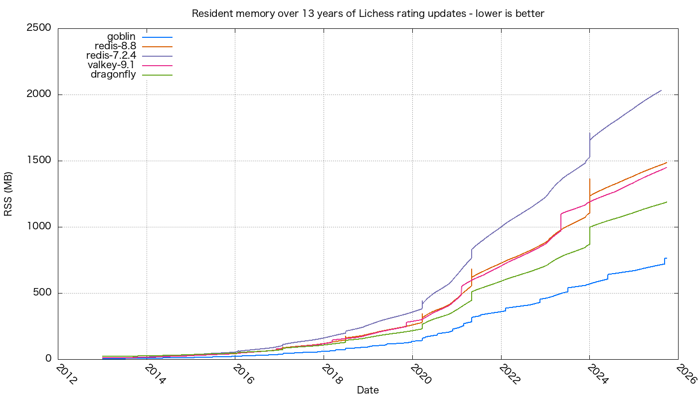

# 14.3 billion chess games in one leaderboard

A chess rating is a sorted set. Every rated game on [Lichess](https://database.lichess.org/)
nudges a player up or down a leaderboard — which is exactly
`ZADD leaderboard <new-rating> <player>`. So we took the real thing: every rated game in
Lichess's public history — 14.3 billion of them, one `ZADD` each, across 21,598,007
players and 4,657 days (12 years and 9 months) of play — and replayed the whole trace into
a single sorted set, on five engines at once.

The workload is nothing but `ZADD` re-scores of players who already exist, with narrow
chess-rating scores (~1000–2000), pipelined in blocks of 128 and streamed over a
UNIX-domain socket with `redis-cli`. We ran goblin-core against Redis 7.2.4, Redis 8.8,
Valkey 9.1, and Dragonfly — all in parallel on one host, each tuned to its best (active
defrag on for the Redis family, persistence off). The fair-measurement details, including
RSS-reporting bugs we fixed in the incumbents against our own favour, are in
[LICHESS-BENCHMARK.md](../LICHESS-BENCHMARK.md).

And it is the same leaderboard: at the end we diffed goblin's
`ZRANGE leaderboard 0 -1 WITHSCORES` against Redis 8.8's, member for member, score for
score. Identical, across all 21,598,007 players.

## Results

| server | redis-cli (s) | os_rss (MB) |
| --- | ---: | ---: |
| goblin | 148,604 | 763.8 |
| redis-8.8 | 160,092 | 1,486.7 |
| redis-7.2.4 | 180,710 | 2,058.6 |
| valkey-9.1 | 158,637 | 1,450.7 |
| dragonfly | 85,546 | 1,187.8 |

[Open the full-size chart](lichess-rss.png)

## Memory is the story

That chart is the whole point, and it holds for the entire replay: goblin is the leanest
line at every single date, and the gap only widens as the leaderboard grows. At the finish
it holds all 21.6 million players in 763.8 MB — about half of Redis 8.8 and Valkey, 37% of
legacy Redis 7.2.4, and 64% of Dragonfly.

Look at the shape, too. The Redis-family curves climb in sharp vertical steps — jemalloc
grabbing new arenas, rehashes reallocating, active-defrag churning — while goblin's line
rises smoothly and stays flat between growth. Same data; a fundamentally different memory
profile. That is the result: for a workload that is nothing but sorted-set writes, goblin
needs roughly half the RAM of the engines it drops in for.

## On speed

Speed is not the headline, and we won't dress it up. On feed time goblin came in a little
ahead of the Redis family — 148,604 s against 158,637 for Valkey, 160,092 for Redis 8.8,
and 180,710 for Redis 7.2.4 — and behind Dragonfly's 85,546 s, which spreads its work
across threads. A modest edge over the engines it replaces, a real gap to Dragonfly. The
client was not the bottleneck; these are the servers' own numbers. The point is that the
memory win costs nothing in throughput: you halve the resident set without falling behind
the engines you are replacing. For head-to-head throughput on isolated micro-benchmarks,
see [BENCHMARKS.md](../BENCHMARKS.md).

In absolute terms the run was quick regardless: goblin replayed 4,657 days of rating
history in about 41 hours, roughly 2,700 times faster than the games were actually played.

## Why the sorted set is so lean

A Redis sorted set is a skip list — members chained in score order through a tower of
forward pointers, one node per member with (on average) about 1.3 levels of pointers each
— paired with a hash table mapping member to score. It is fast, but every member carries a
fistful of 8-byte pointers, and the skip-list nodes and dict entries are separate heap
allocations that fragment over time.

goblin keeps the same two abilities — ordered-by-score, and member to score — but pays far
less for them:

- Small sorted sets are a single allocation. Below a threshold the whole set is a compact
  listpack: count, score width, and length live in an 8-byte header, and members sit
  back-to-back as `[len][score][bytes]`, sorted by (score, member). The store holds one
  tagged pointer per key — no per-element nodes at all.
- Large sorted sets are a chunked sorted list, not a skip list. The score order lives in
  contiguous blocks of about 256 entries; each entry is just 16 bytes — a `double` score, a
  32-bit member id (not a pointer), and the first four bytes of the member name inlined as a
  tie-break accelerator so ordering rarely has to chase the name. The member bytes live
  once, in a packed arena, addressed by that 32-bit id. Finding a score is a search to the
  right block and then within it; there are no per-node level pointers to store or to
  fragment.

That is where half the memory comes from: ids instead of pointers, blocks instead of nodes,
one arena instead of millions of tiny allocations — and, because it is contiguous, it stays
flat and defrag-free as the leaderboard grows to 21.6 million players. This run is that
claim at 14-billion-write scale.

---

See [BENCHMARKS.md](../BENCHMARKS.md) for the controlled micro-benchmarks, and
[LICHESS-BENCHMARK.md](../LICHESS-BENCHMARK.md) for how the memory was measured fairly.
